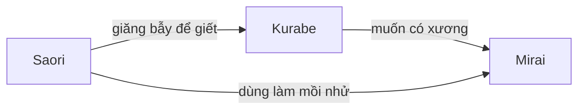
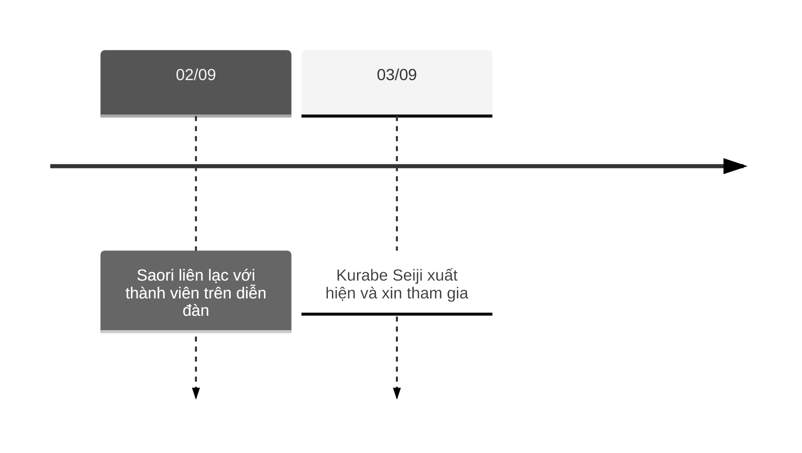
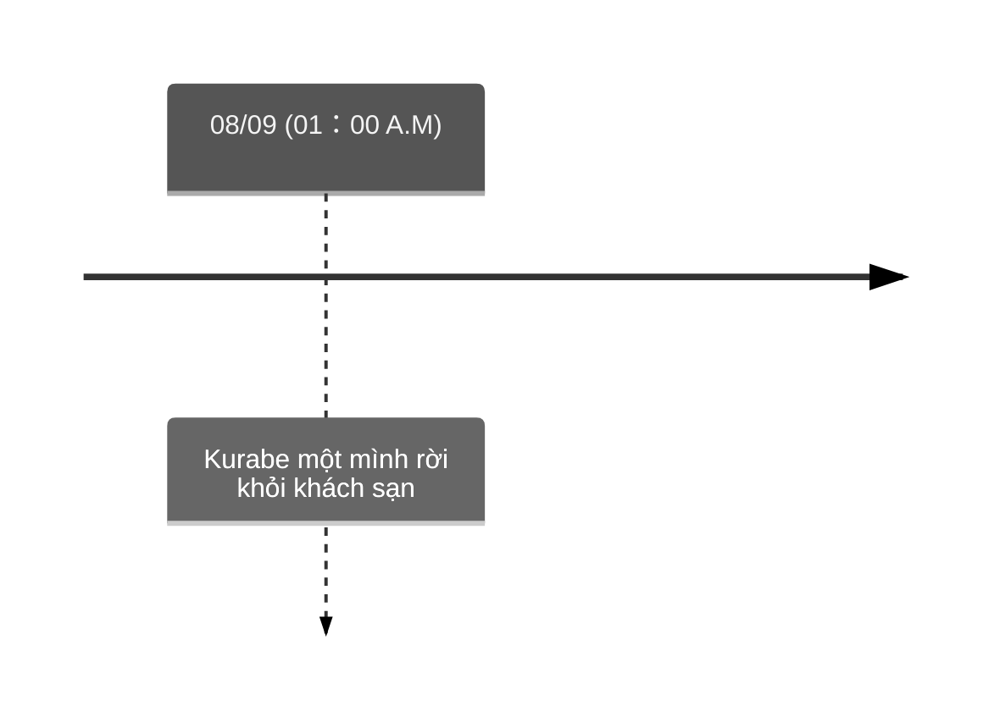
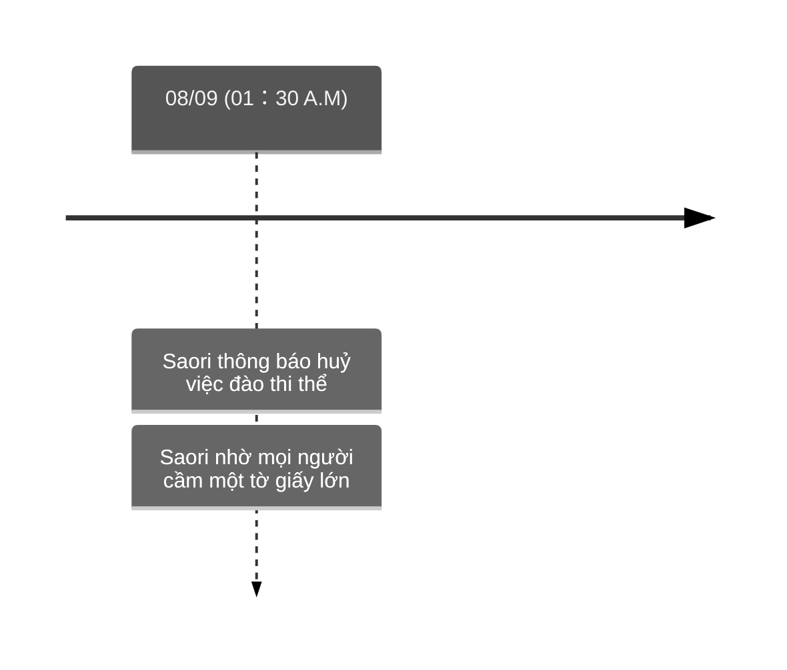
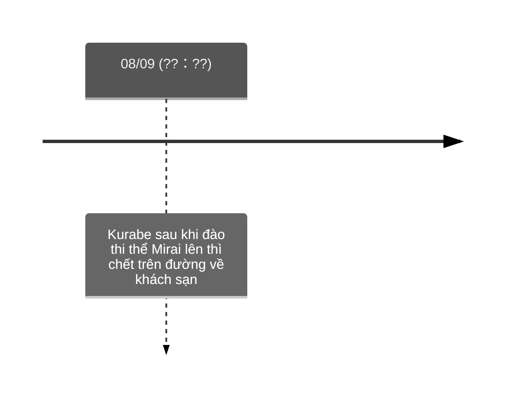

![[Pasted image 20241218093918.png]]

# [Horror Mystery] Họ đã làm gì vào ngày đó?

## Sự việc vào đêm 08 tháng 09

Tôi nhấc máy gọi vào số điện thoại Nazaki gửi.

**Uketsu:** *"Alo, có phải Nazaki đấy không ạ? Gần đây xin lỗi vì làm phiền cô quá."*

**Nazaki:** *"Đúng rồi, mà anh không cần bận tâm đâu, ngược lại tôi còn rất vui ấy chứ. Tìm được người để nói chuyện về Mirara lúc nào cũng vui hết."*

**Uketsu:** *"Mirara...?"*

**Nazaki:** *"Fan thường gọi cô ấy như vậy. Ngoài ra còn 'Miratan' hay 'Miirachan' nữa, nhưng nổi hơn cả vẫn là 'Mirara'."*

**Uketsu:** *"Tại sao Nazaki lại thích Mirai đến như vậy?"*

... Tôi đã luôn muốn hỏi điều này từ khi xem bài đăng nọ.

![[Pasted image 20241218094637.png]]

Về Mirai đối với tôi chỉ là một "idol bị quên lãng sau cái chết của chính mình". Nhưng cuối cùng không phải như vậy.

Cho tới tận bây giờ vẫn còn người nghe những bài hát của cô ấy, lắng nghe và chia sẻ câu chuyện về cô ấy. Có lẽ đối với ai đó thì đây là chuyện bình thường, nhưng đối với tôi là một cảm giác vô cùng mới mẻ.

Rốt cuộc thứ gì đã thu hút Nazaki tới vậy?

**Nazaki:** *"Ừm... Khó để mà diễn tả chỉ bằng một từ... Nhưng nếu có thì sẽ là **nghị lực**?"*

**Uketsu:** *"Nghị lực?"*

**Nazaki:** *"Lúc đó là thời gian đen tối đối với tôi, công việc lẫn mọi chuyện chẳng đi tới đâu cả. Rồi một ngày vì nhận lời mời của đồng nghiệp mà tôi đã có cơ hội lần đầu thấy được Mirara trên sàn diễn. Khi ấy cô bé cũng chỉ mới 15 tuổi nên dĩ nhiên khả năng hát và nhảy vẫn còn chưa tốt, nhưng không rõ tại sao tôi chẳng thể nào rời mắt. Rồi sau khi buổi biểu diễn kết thúc, cô bé có lại gần phía ghế ngồi khán giả và nói **'Bằng mọi giá em phải trở thành idol, làm ơn hãy giúp em trở thành idol với ạ'**. Nghe thật tuyệt đúng không? Một cô bé chỉ mới mười mấy tuổi mà có thể mang theo nghị lực để theo đuổi ước mơ như thế thì làm sao một người lớn như tôi lại đầu hàng được. Tôi có thể sống tới bây giờ là nhờ Mirara đấy."*

**Uketsu:** *"Ra là vậy..."*

**Nazaki:** *"Thế nên lúc nghe tin Mirara mất tích tôi thật sự rất lo lắng, cứ chốc chốc lại kiểm tra internet, có những đêm tôi còn chẳng thể ngủ được. Vào lúc đấy cũng là khi tôi tìm được diễn đàn nọ."*

![[Pasted image 20241218100659.png]]

**Nazaki:** *"Tôi có thể biết được mật khẩu ngay lập tức vì nơi sinh thật sự của Mirara lâu lâu được chính cô bé nhắc tới trong các buổi biểu diễn fan club. Ở diễn đàn cũng có những người thật sự lo lắng cho Mirara làm tôi thấy nhẹ nhõm đi phần nào. Chúng tôi trao đổi thông tin, cùng nhau điều tra về rất nhiều thứ, thời gian đầu mọi người thật sự là những đồng đội đáng tin cậy. Nhưng..."*

... Đột nhiên Nazaki hạ giọng xuống.

**Nazaki:** *"Vào ngày 02 tháng 09, mẹ cô bé tải lên một bài đăng với nội dung hết sức đau buồn."*

**Uketsu:** *"Harukina Saori?"*

**Nazaki:** *"Đúng vậy... Tôi có chụp màn hình lại nên chờ chút nhé."*

![[Pasted image 20241218101217.png]]

```
02/09/2019 0:00 Người đăng: Harukina Saori

Tôi có thông báo tới mọi người.
Vừa ban nãy, tôi có nhận được một cuộc gọi từ người tự xưng là thủ phạm.

Hắn nói rằng Mirai đã chết. Dù không thể cho mọi người xem nhưng tôi đã xác nhận hình ảnh hắn gửi kèm.

Có lẽ là quá đường đột, nhưng dù gì thì tôi nghĩ mọi người cũng nên biết chuyện này sớm hơn ai khác. Xin lỗi vì khiến mọi người phải tốn thời gian hợp tác với nhau cho tới bây giờ để rồi nhận lại kết quả này.
```

**"Người tự xưng là thủ phạm"**...là Kurabe đã gọi điện để báo chuyện này cùng hình ảnh thi thể của Mirai đi kèm...? Tại sao lại làm chuyện như vậy vào lúc đó?

**Nazaki:** *"Ngày hôm đó cũng là ngày đầu tiên tôi nghỉ làm. Tôi thật sự bị sốc và không thể ngừng khóc lúc đó. Chắc có lẽ nghe giống như làm quá lên, nhưng thật sự hy vọng sống của tôi đã không còn nữa rồi."*

**Uketsu:** *"... Chỗ dựa tinh thần của mình phải đón nhận một kết cục như vậy thì đúng là buồn thật."*

**Nazaki:** *"Mọi người ở đó cũng giống tôi, ai cũng bắt đầu tải những bài đăng biểu lộ tâm trạng tuyệt vọng của bản thân khi ấy. Có người thì 'Nói dối, Mirara vẫn chưa chết', có người thì lại 'Tôi thề sẽ tìm ra ai là hung thủ'. Mẹ cô bé - Saori cũng an ủi từng người và bày tỏ sự cảm động trước những nội dung kia. Saori không có thông báo gì mới kể từ khi ấy nên tôi bắt đầu lo lắng, nhưng không lâu sau đó, vào buổi trưa chúng tôi nhận được thêm một tin nhắn mới."*

![[Pasted image 20241218102614.png]]

```
02/09/2019 11:23 Người đăng: Harukina Saori

Cảm ơn vì những lời động viên từ mọi người, nhờ đó mà bản thân tôi cũng bình tĩnh lại phần nào.

Chiều nay tôi sẽ đi tới đồn cảnh sát để trình bày về việc này.
```

**Nazaki:** *"Một mặt thì cũng thấy nhẹ nhõm, nhưng mặt khác thì phải chấp nhận sự thật rằng 'Mirara đã chết rồi' làm tôi lại tiếp tục khóc. Nhưng kể từ đó...mọi chuyện bắt đầu rất kỳ cục."*

**Uketsu:** *"... Nghĩa là sao?"*

**Nazaki:** *"Một lúc sau kể từ bài đăng trên lại có một bài đăng khác từ Saori...nhưng có gì đó lạ lắm."*

![[Pasted image 20241218103306.png]]

```
02/09/2019 13:56 Người đăng: Harukina Saori

Cho phép tôi được hỏi ý kiến mọi người.

Vừa nãy khi chuẩn bị tới đồn cảnh sát thì tôi lại nhận được một cuộc gọi nữa từ hung thủ. Hắn chỉ cho tôi biết Mirai đang được chôn ở đâu.

Để thật lòng mà nói thì bây giờ tâm trạng tôi vô cùng lung lay, đáng lẽ như bình thường thì giờ sẽ cần đi tới đồn cảnh sát và nhờ điều tra giúp khu vực ấy, nhưng tôi không muốn làm vậy.

Cách mà phía cảnh sát thực hiện khi tôi nhờ điều tra về Mirai trước đó làm tôi cực kỳ áp lực, chưa kể khi trình bày việc "Mirai là idol" thì họ còn thẳng mặt trêu đùa và phỉ báng tôi.

Tôi không muốn những kẻ như vậy chạm tay vào cơ thể của Mirai nên có một thỉnh cầu tới mọi người.

Không biết tôi có thể nhờ mọi người cùng tôi đào thi thể Mirai lên được không? Trong 3 tháng vừa qua, tôi có thể hiểu rất rõ rằng mọi người yêu con bé tới mức nào, được bàn tay của mọi người cứu từ lòng đất, hẳn Mirai cũng sẽ rất hạnh phúc.

Với những ai có thể tham gia được hãy gửi cho tôi địa chỉ mail, tôi sẽ gửi vị trí thi thể và ngày thực hiện cho từng người.

```

**Uketsu:** *"'Không biết tôi có thể nhờ mọi người cùng tôi đào xác Mirai lên được không'...?"*

**Nazaki:** *"Không phải là tôi không hiểu được cảm giác của Saori, nhưng dù sao nhờ chúng tôi - những người bình thường một việc như vậy là rất kỳ lạ. Mọi người khác lúc ấy cũng giống tôi, nói với Saori rằng **'nên đến đồn cảnh sát thì hơn'**."*

**Uketsu:** *"Đúng là vậy nhỉ."*

**Nazaki:** *"Nhưng Saori vẫn một mực không thay đổi quyết định, sau đó là những bài văn dài nói về việc Mirara khi còn sống đã yêu quý fan của mình tới nhường nào... Dù đúng là có cảm động nhưng cũng không hề làm tôi nghĩ rằng 'sẽ tham gia để đi đào xác lên', mọi người khác cũng giống vậy. Nhưng rồi có lẽ là do bản thân nơi đó tụ tập số lượng người ít ỏi như vậy với một mục đích chung gắn kết với nhau khăng khít như vậy, nên bằng lời nói của Saori đã gây ra hiện tượng giống với bài diễn thuyết của Hojo Masako, dần dần ý chí của mọi người đã hợp thành một...rồi tin nhắn xin tham gia cứ thế lần lượt xuất hiện."*

**Uketsu:** *"Việc đó...đúng là dị thường thật nhỉ. Nhưng tại sao Saori lại có khả năng thuyết phục mọi người mạnh mẽ đến thế?"*

**Nazaki:** *"Fan của Mirara có một ấn tượng rất mạnh tới Saori, bà không chỉ là mẹ mà còn là cộng sự cùng nhau tiến thân vào giới nghệ sĩ, mọi người đều biết chuyện này. Giả sử như tiêu đề album đầu tiên của Mirara là **'Song for RIMI'**..."*

![[Pasted image 20241218111512.png]]

**Nazaki:** *"'RIMI' không phải tên người mà là **biểu tượng cho mối liên kết giữa Mirara và Saori**."*

**Uketsu:** *"Liên kết...?"*

**Nazaki:** *"'Sao**ri mi**rai'. Mirara ở buổi live có nói rằng cả hai đều đã luôn trân trọng từ này và quyết định sẽ dùng nó cho album đầu tiên."*

**Uketsu:** *"Ra vậy..."*

**Nazaki:** *"Thế nên lời nói của Saori có một sức mạnh đặc biệt. Ở nơi đó, những gì Saori nói là tuyệt đối."*

... Kể cả có là yêu cầu phạm pháp đi nữa...

**Nazaki:** *"Rồi không biết từ khi nào để đến khi nhận ra thì tôi là người duy nhất chưa gửi tin nhắn tham gia yêu cầu kia. Vì sợ mọi người nghĩ rằng mình là đồ phản bội, sợ bị xa lánh nên cuối cùng tôi cũng nhắn xin tham gia luôn."*

**Uketsu:** *"... Tâm lý đám đông nhỉ."*

**Nazaki:** *"Vâng, chắc là vậy... À, với lúc đó có xảy ra một việc nữa."*

**Uketsu:** *"Là gì vậy?"*

**Nazaki:** *"Tự nhiên xuất hiện một người từ trước tới giờ chưa từng tham gia trao đổi, chưa đăng một bài viết nào nhắn xin tham gia."*

**Uketsu:** *"...!"*

... Hẳn phải là Saruhari Naoki.

![[Pasted image 20241218131148.png]]

Đồng phạm với Kurabe đang làm gì ở đây?

**Nazaki:** *"Người đó cũng làm theo yêu cầu của Saori và cung cấp ảnh giấy tờ tuỳ thân. Cho tới tận bây giờ lý do tại sao người này lại tham gia đào thi thể lên vẫn là dấu hỏi với tôi."*

... Tôi lặng người đi giây lát khi xem tấm ảnh Nazaki gửi.

![[Pasted image 20241218131457.png]]

**Uketsu:** *"Kurabe Seiji...!?"*

... Tâm trí tôi bắt đầu hỗn loạn, là tên hung thủ Kurabe... Hắn liên lạc cho Saori, nhận mình là thủ phạm, gửi địa điểm thi thể, rồi lại trà trộn vào các fan để tham gia đào thi thể lên?

Tôi hoàn toàn chẳng thể lý giải nổi chuyện gì đang xảy ra nữa.

**Nazaki:** *"Việc Kurabe xuất hiện đột nhiên như vậy không tránh khỏi nghi ngờ từ mọi người, nhưng Saori lại không vấn đề gì về yêu cầu tham gia nên không khí cũng dịu dần xuống."*

**Uketsu:** *"..."*

... Kể từ sau đó, Saori bắt đầu trực tiếp gửi mail cho từng người.

![[Pasted image 20241218132239.png]]

Bà ấy một mình điều chỉnh lịch trình, đặt phòng khách sạn và báo số phòng cho từng người vào ngày 04 tháng 09.

![[Pasted image 20241218132735.png]]

**Nazaki:** *"Nội dung mail ghi rằng 'Vì sẽ tiến hành vào buổi đêm nên mong mọi người tới khách sạn gần đó vào ngày 07 tháng 09, lúc 10h tối và tiến hành check in'. Sau khi sắp xếp thì tôi thuộc phòng 601."*

... Kể từ đây, mọi mảnh ghép đều bắt đầu liên hệ với nhau một cách không ngờ tới.

![[Pasted image 20241218140711.png]]

Việc tập hợp mọi người lại khách sạn...là do Saori đang lên kế hoạch giết Kurabe.

**Nazaki:** *"Dù cảm thấy không ổn chút nào nhưng ngày 07 tháng 09 tôi vẫn tới khách sạn đúng như đã được dặn. Vào buổi chiều, chúng tôi nhận được mail thông báo rằng mọi người đều đã vào khách sạn. Sau đó vào ngày 08, khoảng 01 giờ sáng, chúng tôi nhận được mail thông báo về vị trí thi thể và thời gian tập hợp."*

![[Pasted image 20241218141049.png]]

**Nazaki:** *"Trong đó ghi rằng 'vì ta sẽ xuất phát vào lúc 02 giờ sáng nên nhờ mọi người tập trung tại sảnh trước lúc đó'."*

![[Pasted image 20241218141447.png]]

... Cứ mỗi lần nhận mail từ Saori, Nazaki nói rằng nghi cảm trong cô lại ngày một lớn hơn.

**Nazaki:** *"Ngay từ đầu tại sao hung thủ lại cho Saori biết về nơi chôn thi thể? Nếu thi thể bị tìm thấy không phải nguy cơ hắn bị bắt cũng cao lên hay sao? Cứ cho là vì cảm giác tội lỗi, nhưng cũng không tới mức phải đưa mình vào nguy hiểm như vậy nhỉ? Chưa kể Saori đối với tên hung thủ cũng vô cảm một cách kỳ lạ, thông thường nếu nhận được những cuộc gọi như thế người ta sẽ thắc mắc 'hắn là ai' hoặc 'có khi nào mình cũng đang bị nhắm tới', không phải sao? Nhưng bài đăng của Saori toàn là nội dung về việc đào thi thể lên chứ có vẻ hoàn toàn không có hứng thú gì với tên hung thủ kia. Cảm giác như **sự tồn tại của tên hung thủ quá đỗi mờ nhạt** vậy."*

**Uketsu:** *"Mờ nhạt..."*

**Nazaki:** *"Nếu như vậy thì...có khi nào 'hung thủ' ngay từ đầu chẳng tồn tại mà **chỉ là do Saori dựng chuyện lên** hay không?"*

... Vì luôn giữ suy nghĩ "Kurabe là hung thủ" nên cho tới bây giờ tôi chưa từng nghĩ về việc đó dù chỉ một lần. Nhưng đúng là hành động của Saori có rất nhiều điểm bất hợp lý.

**Nazaki:** *"Vào lúc đó, tôi bắt đầu suy nghĩ tới 'một khả năng khác'. Uketsu có biết về những bài đăng cuối cùng của Mirara để lại trên X không?"*

**Uketsu:** *"Vâng, tôi có biết."*

![[Pasted image 20241218142332.png]]

**Nazaki:** *"Lúc đấy mọi người đều nghĩ rằng Mirara khi đi ra ngoài thì bị ai đó tiếp cận nên đã bỏ chạy và trốn vào nhà vệ sinh công cộng. Nhưng tôi thì không hề nghĩ vậy."*

![[Pasted image 20241218142619.png]]

**Nazaki:** *"Vì bị tiếp cận nên sợ, bỏ chạy và trốn vào nhà vệ sinh thì có thể hiểu được, nhưng tại sao lại phải nêu ra là 'cũng khoá cửa luôn rồi'?"*

**Uketsu:** *"... Nghĩa là sao?"*

**Nazaki:** *"Bởi vì nếu là nhà vệ sinh công cộng thì khi bước vào, việc khoá cửa không phải là hiển nhiên hay sao? Việc bước vào trong nhà vệ sinh và khoá cửa luôn luôn phải đi cùng nhau."*

**Uketsu:** *"Ồ... Đúng là vậy nhỉ..."*

**Nazaki:** *"Giả sử Mirara chỉ ghi dòng trên 'đã chạy vào nhà vệ sinh rồi' thì nhà vệ sinh công cộng có vẻ hợp lý. Nhưng nếu đi cùng với dòng dưới 'đã khoá cửa luôn rồi' có nghĩa là **bình thường thì không khoá cửa, chỉ duy nhất lần đó vì lý do đặc biệt gì mà mới khoá cửa**."*

**Uketsu:** *"Ra là vậy..."*

**Nazaki:** *"Thế nên tôi nghĩ rằng nơi mà Mirara đăng những dòng này không phải là nhà vệ sinh công cộng đâu."*

**Uketsu:** *"... Ví dụ như nhà vệ sinh ở nhà người yêu hay bạn bè...?"*

**Nazaki:** *"Một cô gái trẻ tầm tuổi đó đi vệ sinh ở nhà người yêu mà không khoá cửa nghe không tự nhiên chút nào. Còn nhà bạn bè...ít nhất nếu là tôi thì sẽ khoá. Bình thường có thể vào mà không cần khoá cửa thì **chỉ có nhà của chính mình** mà thôi."*

**Uketsu:** *"Hả... Nghĩa là..."*

**Nazaki:** *"Mirara đã bị ai đó trong nhà đuổi và phải chạy trốn vào nhà vệ sinh. Ban đầu tôi nghĩ là trộm nhưng nếu thế thì rất kỳ cục. Mirara chạy vào nhà vệ sinh và đăng những dòng trên, nghĩa là lúc đó **có mang theo điện thoại**. Nếu đối phương thật sự là một tên biến thái đáng sợ thì cứ gọi cảnh sát là xong không phải sao? Ai lại đi mở X lên đăng bài bao giờ? Mirara dù lúc đó sợ nhưng vẫn nghĩ rằng 'chuyện không lớn tới mức đó', đối phương chắc chắn phải là ai đó cực kỳ thân thiết hoặc là **người nhà**."*

... Người nhà của Mirai...**chỉ có một người duy nhất**.

**Nazaki:** *"Khi vẫn còn đang sắp xếp lại suy nghĩ thì tôi nhận được một mail khác gửi tới vào 01 giờ 30 phút sáng, sớm hơn thời gian tập trung 30 phút. Nội dung trong mail toàn là những lời mà tôi tới bây giờ vẫn chẳng thể hiểu được. "*

![[Pasted image 20241218145527.png]]

```
Liên lạc khẩn cấp 08/09/2019 01:30

Xin lỗi nhưng kế hoạch sẽ thay đổi một chút. Mong mọi người đừng rời khỏi phòng, thay vào đó hãy làm theo chỉ thị của tôi.

Không phải là việc khó gì cả, sau khi tôi ra dấu thì nhờ mọi người đưa tay ra cửa, có lẽ chỉ tốn vài phút thôi nhưng hãy cầm giúp tôi một tờ giấy.

Chi tiết sẽ được liên lạc sau.
```

... Đây rõ ràng là chỉ thị cho việc **giết người từ xa**.

Vậy người làm Kurabe gây tai nạn chết quả nhiên chính là Saori. Rốt cuộc bà ấy đang định làm gì...?

**Nazaki:** *"Tôi không thể hiểu nổi nữa. Tại sao giữa chừng lại không đi đào thi thể, tại sao lại phải đưa tay ra cửa sổ để cầm một tờ giấy, rồi tờ giấy đó rốt cuộc là gì. Dù không rõ lý do nhưng vào lúc ấy niềm tin của tôi vào Saori đã gần trở về 0. Nếu cứ tiếp tục nghe lời bà ấy thế này thì không chừng sẽ bị vướng vào chuyện gì cực kỳ đáng sợ nên tôi đã một mình đi xuống check out rồi rời khách sạn. Kể từ đó tôi cũng không vào diễn đàn kia nữa, người ta nói hung thủ là Kurabe nhưng tôi thì không hề nghĩ vậy."*

... Ở đây, từng điểm một trong câu chuyện bắt đầu xâu chuỗi cùng nhau.

![[Pasted image 20241218150427.png]]

Vào đêm đó, lý do khiến tờ giấy bị lật bởi gió mạnh...

![[Pasted image 20241218150453.png]]

Là vì ở phòng 601 không hề có người. Vì Nazaki rời đi nên trọng tâm của hình chữ nhật cũng bị thay đổi.

Nhưng dù vậy kế hoạch vẫn thành công. Giả sử có một người khác cũng giống Nazaki, cũng rời đi sớm đêm hôm đó thì có lẽ mọi chuyện đã khác...

**Uketsu:** *"Nếu theo suy đoán của Nazaki thì người sát hại Harukina Mirai chính là Saori nhỉ? Lý do gì mà một người mẹ lại đi giết chính con mình...?"*

**Nazaki:** *"Chuyện đó thì tôi không biết. Dù không biết nhưng..."*

**Uketsu:** *"...?"*

**Nazaki:** *"Tin tức từ ngày 08 tháng 09 trở đi có đăng 'sau khi so sánh DNA trên thi thể và DNA trên tóc tìm được tại nhà riêng đã có thể xác định danh tính'."*

**Uketsu:** *"À, tôi cũng có đọc tin này."*

![[Pasted image 20241218151058.png]]

**Nazaki:** *"Không phải rất lạ hay sao?"*

**Uketsu:** *"Chuyện gì lạ cơ?"*

**Nazaki:** *"Đúng là có thể xác định DNA dựa vào tóc, nhưng ngoài ra còn một cách khác chính xác hơn rất nhiều là **so sánh với DNA cha mẹ** cơ mà."*

**Uketsu:** *"Hả?"*

**Nazaki:** *"Con người ta thừa hưởng phân nửa DNA lần lượt từ cha và mẹ"*

![[Pasted image 20241218151358.png]]

**Nazaki:** *"Vậy nên cha hoặc mẹ và con cái sẽ có 50% trùng khớp DNA với nhau. Trường hợp khớp 50% chỉ có thể là cha mẹ với con cái hoặc anh em chị em. Nếu muốn xác định danh tính thi thể thì không phải **so sánh DNA với mẹ là Saori** sẽ chính xác hơn hay sao?"*

**Uketsu:** *"Đúng là vậy thật..."*

**Nazaki:** *"Vậy thì tại sao cảnh sát không dùng cách đó... Hay có khi nào Saori ngay từ đầu vốn chẳng phải là mẹ ruột của Mirara không chừng."*

... Cuối cùng, Nazaki nói với tôi rằng "Dù còn lại chỉ toàn là ký ức đau buồn, nhưng tôi vẫn sẽ là fan của Mirara suốt đời này" rồi cúp máy.

Tôi quyết định không nói gì với cô ấy về câu chuyện "giết người từ xa".

### Tay trong

Việc Saori có liên hệ mật thiết tới vụ án là không thể nhầm được. Nhưng rốt cuộc bà ấy và Kurabe có quan hệ như thế nào?

Và tay trong - Saruhari Naoki là ai?

Saruhari Naoki... **sa ru ha ri na o ki**

![[Pasted image 20241218152508.png]]

Anagram... Vậy "Saruhari Naoki" là tên giả của Saori.

Nếu vậy thì...

![[Pasted image 20241218152550.png]]

Người trọ lại Hichiyagi Hotel vào đêm 08 tháng 06 mà Mirai mất tích và **người chôn thi thể cũng là Saori**.

Một người luôn ủng hộ ước mơ của Mirai, một người có mối liên kết mạnh mẽ tới Mirai như vậy tại sao lại làm điều này?

Giữa mẹ và con gái rốt cuộc đã xảy ra chuyện gì?

### Bản tính

... Ngày hôm sau, tôi báo kết quả điều tra lại với Kurihara.

**Kurihara:** *"Vậy nghĩa là Kurabe và Saori là đồng phạm?"*

**Uketsu:** *"Tôi chỉ có thể nghĩ như vậy."*

| Thời gian             | Sự việc                                                                                                                        |
| --------------------- | ------------------------------------------------------------------------------------------------------------------------------ |
| 08/06                 | Harukina Mirai mất tích<br>Saruhari (Saori) trọ tại Hichiyagi Hotel                                                            |
| 30/06                 | Saori tạo diễn đàn,<br>nhờ mọi người tìm kiếm thông tin về Mirai                                                               |
| 02/09                 | Saori liên lạc với thành viên trên diễn đàn<br>"Hung thủ đã cho biết vị trí của thi thể"<br>"Mong muốn mọi người cùng đào lên" |
| 03/09                 | Kurabe Seiji xuất hiện và xin tham gia                                                                                         |
| 07/09                 | Mọi người bao gồm Kurabe trọ lại Hichiyagi Hotel                                                                               |
| 08/09 <br>(00:58 A.M) | Saori thông báo về vị trí thi thể tới mọi người                                                                                |
| 08/09 <br>(01:00 A.M) | Kurabe một mình rời khỏi khách sạn                                                                                             |
| 08/09 <br>(01:30 A.M) | Saori thông báo huỷ việc đào thi thể,<br>thay vào đó nhờ mọi người cầm một tờ giấy lớn                                         |
| 08/09 <br>(??:??)     | Kurabe sau khi đào thi thể Mirai lên thì chết trên đường về khách sạn                                                          |

**Uketsu:** *"Dù không rõ động cơ là gì, nhưng cả hai đã sát hại Mirai, chôn thi thể, kêu gọi fan, tạo nên một tên hung thủ khác không tồn tại rồi nhờ mọi người đào cái xác lên. Nhưng cuối cùng Saori đã phản bội Kurabe."*

**Kurihara:** *"Có thật là như vậy không?"*

**Uketsu:** *"Hả?"*

**Kurihara:** *"Có thật sự hai người này là hung thủ hay không?"*

**Uketsu:** *"Nhưng..."*

**Kurihara:** *"Đầu tiên, về việc Mirai bị sát hại."*

![[Pasted image 20241218161317.png]]

**Kurihara:** *"Đúng là từ nội dung bài đăng trên có thể suy đoán Saori là hung thủ. Việc 'chỉ có ở nhà thì đi vệ sinh mới không khoá cửa' nếu là nữ giới thì sẽ hiểu ngay, tiếc rằng tôi không phải là nữ nên đã bỏ sót chi tiết này."*

**Uketsu:** *"Anh đang cay cú vì thua đấy à?"*

**Kurihara:** *"... Tiếp theo ta đến với việc giấu thi thể của Mirai."*

![[Pasted image 20241218162220.png]]

**Kurihara:** *"Theo danh sách trên thì ngày đó trọ lại chỉ có Saruhari (Saori), không hề có Kurabe, hay nói cách khác chỉ có một mình Saori tham gia chôn thi thể. Tóm gọn lại thì tôi nghĩ người gây ra tội ác đầu tiên...sát hại Mirai và chôn thi thể đều là Saori tự làm một mình. Nếu Kurabe là đồng phạm thì phải là hai người cùng làm, hoặc phải giúp nhau theo cách nào đó, không phải sao?"*

**Uketsu:** *"Thì đúng là như vậy thật..."*

**Kurihara:** *"Ta cùng xem lại mốc thời gian hôm 08/09 sẽ hiểu được một việc khác nữa."*


**Kurihara:** *"Saori thông báo vị trí thi thể cho mọi người vào lúc 00:58, Kurabe rời khỏi khách sạn vào từ 01:00. Theo như diễn biến này thì có thể hiểu là 'sau khi nhận được mail từ Saori thì Kurabe vội vã rời khách sạn' sẽ rất hợp lý. Nghĩa là trước khi nhận được mail từ Saori thì Kurabe không hề biết thi thể được chôn ở đâu, một người như vậy có thể gọi là 'hung thủ' hay không?"*

**Uketsu:** *"Nhưng nếu không phải hung thủ... Nói cách khác Kurabe hoàn toàn không liên quan tới vụ án này thì hành động của hắn cũng rất khó hiểu. Tại sao hắn lại tìm tới vào diễn đàn kia và xin được tham gia?"*

**Kurihara:** *"Vì có thể hắn cũng là fan không chừng?"*

**Uketsu:** *"Ờ... Kurabe đơn giản chỉ là fan của Mirai nên mới xin Saori cho được tham gia...hm? Chờ đã, nếu vậy thì tại sao Kurabe lại rời đi để đào thi thể lên trước giờ tập trung như vậy?"*

**Kurihara:** *"Vì hắn muốn xương của Mirai...?"*

**Uketsu:** *"... Xương? Người ta có phải chó đâu?"*

**Kurihara:** *"Nếu suy nghĩ như thế thì Kurabe sẽ là một tên 'cực kỳ thèm muốn xương của Mirai'."*

**Uketsu:** *"Thèm tới mức vội vã rời khách sạn để đi đào lên như vậy nhỉ."*

**Kurihara:** *"Và Saori đã lợi dụng bản tính giống chó ấy của Kurabe để dụ hắn ra ngoài và giết hại. Nói cách khác thì để Kurabe rơi vào bẫy, Saori đã dùng chính Mirai để làm mồi nhử."*

**Uketsu:** *"Nếu thế thì lại càng khó hiểu hơn nữa."*

**Kurihara:** *"Không sao cả. Bây giờ ta sẽ thử suy đoán tiếp dựa theo giả thuyết trên, không chừng mọi thứ sẽ hợp lý đấy."*

### Ba người



Mối quan hệ phức tạp thật sự có liên quan tới chìa khoá của vụ án?

Trước mắt tôi quyết định im lặng nghe suy đoán của Kurihara.

**Kurihara:** *"Vậy tôi sẽ bắt đầu giải thích theo trình tự thời gian."*


**Kurihara:** *"Ngày 08 tháng 06, Saori giết hại chính con gái mình là Mirai rồi đem chôn ở một khu rừng thuộc tỉnh Mie, sau đó báo cảnh sát là con gái mình 'mất tích'. Mirai là người trong giới nghệ sĩ nên hẳn sẽ có nhiều nơi đưa tin vào lúc ấy, Kurabe khi đọc được đã nghĩ **'nếu Mirai cứ thế này mà mất tích thì cả đời mình sẽ không thể nào có được xương của cô ấy'**... Nên đã vội vã bắt đầu tự tìm kiếm thông tin về Mirai."*


**Kurihara:** *"Ngày 30 tháng 06, Saori tạo diễn đàn và nhờ fan tìm kiếm thông tin về Mirai... Trông có vẻ là vậy nhưng thực chất là cái bẫy để dụ Kurabe. Trong khi đang tìm đỏ mắt thông tin về Mirai với tâm trạng như côn trùng chết cháy dưới cái nóng mùa hè, hắn tìm được nơi này và bắt đầu kiểm tra xem có thông tin nào quan trọng được ghi lại hay không."*



**Kurihara:** *"Saori bắt đầu hành động vào ngày 02 tháng 09, đăng bài nói là **hung thủ đã liên lạc với mình và chỉ nơi chôn thi thể**. Không cần phải nói, đây là mồi nhử từ kết quả tự biên tự diễn để nhử Kurabe, chẳng có 'hung thủ' nào cả, kẻ chôn thi thể xuống chính là Saori. Nhưng Kurabe vì không biết gì mà đã cắn câu không do dự kèm suy nghĩ **'sẽ tham gia và cướp lấy thi thể'**."*


**Kurihara:** *"Mọi người tập trung ở Hichiyagi Hotel. Vào ngày 08 trước 01 giờ sáng, Saori thông báo tới tất cả mọi người về địa điểm chôn thi thể, mấu chốt chính là việc **thông báo vào trước 1 tiếng cho tới khi tập trung**. Kurabe đã nghĩ đây là cơ hội, **'từ giờ tới lúc tập trung vẫn còn tận 1 tiếng, vậy thì sẽ một mình đi đến điểm chôn thi thể, đào lên rồi giấu vào cốp xe là xong.'**"*



**Kurihara:** *"... Kurabe bắt đầu rời khỏi khách sạn."*



**Kurihara:** *"Vào 01 giờ 30 phút sáng, lần này là Saori hành động, bà nhắn tất cả các thành viên **ngoại trừ Kurabe** tham gia vào kế hoạch 'giết người từ xa'. Trừ Nazaki, các thành viên khác dù chẳng hiểu gì nhưng vẫn làm theo."*



**Kurihara:** *"Kurabe sau khi có được thi thể Mirai vì mắc bẫy của Saori mà chết trên đường về. Sáng hôm sau đó, người ta tìm được xe của Kurabe, cùng thời điểm đó cũng tìm được thi thể của Mirai nên phía cảnh sát đã nhầm rằng **Kurabe là hung thủ**. Tất cả cuối cùng đều nằm gọn trong lòng bàn tay của Saori."*

... Nếu tổng hợp lại thì sẽ trông thế này.

| Thời gian            | Sự việc                                                                                                                                                                                                                                                     |
| -------------------- | ----------------------------------------------------------------------------------------------------------------------------------------------------------------------------------------------------------------------------------------------------------- |
| 08/06                | Harukina Mirai mất tích<br>Saruhari (Saori) trọ tại Hichiyagi Hotel<br>**→ Saori giết hại Mirai và đem chôn gần Hichiyagi Hotel**<br>**→ Saori báo với cảnh sát rằng "con gái mình mất tích"**<br>**→ Kurabe đọc được tin tức và tiến hành tìm kiếm Mirai** |
| 30/06                | Saori tạo diễn đàn,<br>nhờ mọi người tìm kiếm thông tin về Mirai<br>**→ Mục đích thật sự là để dụ Kurabe vào tròng**<br>**→ Kurabe tìm ra diễn đàn đúng như dự đoán của Saori**                                                                             |
| 02/09                | Saori liên lạc với thành viên trên diễn đàn<br>"Hung thủ đã cho biết vị trí của thi thể"<br>"Mong muốn mọi người cùng đào lên"<br>**→ Đây là lời nói dối do Saori tự dựng chuyện**                                                                          |
| 03/09                | Kurabe Seiji xuất hiện và xin tham gia<br>**→ Vì chẳng biết gì nên Kurabe đã nghĩ "Đây là cơ hội để cướp lấy xương Mirai" và xin tham gia**                                                                                                                 |
| 07/09                | Mọi người bao gồm Kurabe trọ lại Hichiyagi Hotel                                                                                                                                                                                                            |
| 08/09<br>(00:58 A.M) | Saori thông báo về vị trí thi thể tới mọi người                                                                                                                                                                                                             |
| 08/09<br>(01:00 A.M) | Kurabe một mình rời khỏi khách sạn<br>**→ Với dự định sẽ lẻn đi trước giờ tập trung và cướp lấy thi thể**                                                                                                                                                   |
| 08/09<br>(01:30 A.M) | Saori thông báo huỷ việc đào thi thể,<br>thay vào đó nhờ mọi người cầm một tờ giấy lớn                                                                                                                                                                      |
| 08/09<br>(??:??)     | Kurabe sau khi đào thi thể Mirai lên thì chết trên đường về khách sạn<br>**→ Cảnh sát phát hiện thi thể trong xe và tưởng nhầm "Kurabe là hung thủ"**                                                                                                       |

... Đúng là cách suy nghĩ này hoàn toàn hợp lý, hay đúng hơn là nếu không nghĩ thế thì hoàn toàn không có cách nào để lý giải những điểm bất thường trong vụ án này. Nhưng rốt cuộc động cơ là gì?

Lý do mà Kurabe muốn có xương của Mirai.

Lý do mà Saori muốn giết Kurabe.

Lý do Mirai bị dùng làm mồi nhử.

**Uketsu:** *"Saori đã từng là một người mẹ hết sức ủng hộ ước mơ của con gái mình vậy mà..."*

**Kurihara:** *"Về chuyện đó, Uketsu có còn nhớ về câu nói của Mirai không?"*

**Uketsu:** *"Câu nói nào cơ?"*

**Kurihara:** *"**'Bằng mọi giá em phải trở thành idol, làm ơn hãy giúp em trở thành idol với ạ'**... Đối với Nazaki thì đây là 'nghị lực', nhưng từ góc nhìn của tôi thì đây giống 'ép buộc' hơn. Tại sao Mirai lại muốn trở thành idol tới mức đấy?"*

**Uketsu:** *"..."*

**Kurihara:** *"Trong kế hoạch của Saori cần phải có những 'fan cuồng'. Nếu không có niềm tin vững chắc thì kế hoạch 'giết người từ xa' đã chẳng thể thành công. Chưa kể nếu Mirai là người trong giới nghệ sĩ thì tin mất tích cũng dễ tới tai Kurabe hơn... Có thể ngay từ đầu Mirai đã nhận được lệnh từ mẹ là 'phải trở thành idol' cũng nên."*

**Uketsu:** *"Vậy nghĩa là...Mirai ngay từ đầu đã được Saori nuôi nấng để trở thành công cụ giết Kurabe...?"*

**Kurihara:** *"Không chắc có lý do gì để phải làm tới mức đó. Nhưng tôi cũng một phần đồng ý về việc Nazaki nghi ngờ 'Saori có phải mẹ ruột của Mirai hay không'."*

... Kurihara để lại một câu nói đầy ẩn ý rồi cúp máy.

### Kết nối

Tôi không thể hiểu được.

![[Pasted image 20241219090902.png]]

**"Kurabe Seiji", "Harukina Saori", "Harukina Mirai"**

Giữa họ đã xảy ra chuyện gì?

Thứ duy nhất có liên quan tới cả ba người cho tới bây giờ cũng chỉ có diễn đàn kia.

Tôi mở màn hình nhập mật khẩu lên để kiểm tra lần nữa.

![[Pasted image 20241219091110.png]]

Với những người sống ở vùng Kanto khi nhắc tới "Kawagoe" thì sẽ nghĩ ngay tới thành phố Kawagoe thuộc tỉnh Saitama. Nhưng giả sử với trường hợp "Yuzawa" có ở cả 2 tỉnh Akita và Niigata, ở Nhật có những trường hợp tên địa danh bị trùng nhau như vậy.

Liệu "Kawagoe" chỉ có ở Saitama hay không? Để trả lời tôi liền tìm trên mạng với từ khoá "Kawagoe, địa danh".

Kết quả tìm được là những thứ mà tôi chưa từng nghĩ tới, vào lúc đó, tâm trí tôi như vừa mở ra một con đường mới dẫn đến mối liên kết của từng điểm trong vụ án.

Giờ thì tôi đã hiểu rõ tất cả.

Lý do Kurabe muốn có xương của Mirai.

Lý do Saori muốn giết Kurabe.

... Và Harukina Mirai thực ra là ai.

***[Kỳ cuối: Chân tướng của toàn bộ sự việc]***

[[index]]

---

**Bài viết này chỉ là bản dịch từ [truyện ngắn](https://youtu.be/2w00oMLBpuk?si=JHgS4dWcaAm99ITX) của của tác giả Uketsu (雨穴)**

**KHÔNG REPOST DƯỚI MỌI HÌNH THỨC**