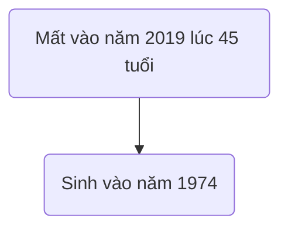
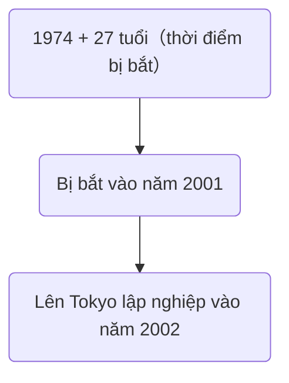
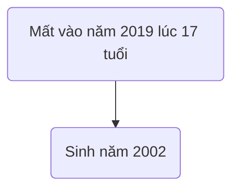
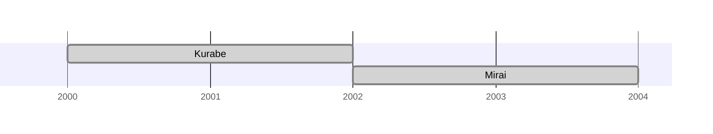

![[17218811512iyyn-1174x630.jpg]]
# [Horror Mystery] Họ đã làm gì vào ngày đó?

## Phần 4: Harukina Mirai

**Kurihara:** *"Alo."*

**Uketsu:** *"Kurihara, tôi hiểu rồi."*

**Kurihara:** *"Hiểu gì cơ?"*

**Uketsu:** *"Về mối quan hệ giữa hai mẹ con Harukina và Kurabe Seiji"*

... **"Kawagoe"** có thể dùng để chỉ 2 địa danh.

Một là thành phố Kawagoe thuộc tỉnh Saitama.

Còn lại là...

![[Pasted image 20241223085353.png]]

**Kawagoe thuộc tỉnh Mie.**

**Kurihara:** *"Tỉnh Mie...Hichiyagi Hotel...à không, là nơi sinh của Kurabe Seiji. Vậy là Mirai và Kurabe có cùng quê quán à."*

**Uketsu:** *"Đúng vậy, nơi liên kết hai con người này không phải Tokyo mà là **Mie**."*

![[Pasted image 20241223085617.png]]

Kurabe Seiji

45 tuổi, sinh ra tại Mie.

Hắn là con trai thứ của chủ tịch tập đoàn "Harigara Group" tại địa phương, sau khi tốt nghiệp đại học không có công việc ổn định mà chọn lối sống buông thả. Thời trẻ hẳn đã từng rất nhiều lần phạm tội liên quan tới quấy rối phụ nữ, nhưng lần nào cũng vì tiền bạc và mối quan hệ từ cha mẹ mà được thả.

Nhưng vào năm 27 tuổi khi bị bắt lần thứ 4, vì không có cách nào kháng cáo nên hắn đã phải chấp nhận ngồi tù 1 tháng. Sau đó không rõ vì đã hối hận hay vì lý do gì, nhưng không có ghi chép nào về việc hắn phạm tội nữa.

1 năm kể từ lúc bị bắt, hắn rời cha mẹ lên Tokyo lập nghiệp và kết hôn vào năm 32 tuổi. Hắn cũng đổi từ họ cha mẹ đặt là "Harigara" sang họ vợ là "Kurabe".

Kurabe bị bắt lần thứ 4 vào năm 2001. 1 năm sau đó hắn lên Tokyo lập nghiệp nghĩa là **trước năm 2002 hắn đã ở Mie**.

Còn về phía Mirai...

Thời gian cả hai cùng ở Mie **chỉ có năm 2002**. Dù rất ngắn nhưng đối với tôi, chính **sự ngắn ngủi** này là mấu chốt của mọi thứ. Mang suy nghĩ đó tìm kiếm thông tin một hồi lâu và tôi dừng lại ở bài viết nọ.

![[Pasted image 20241223093706.png]]

Một bài viết cũ đăng lên web magazine được cập nhật thường xuyên nói về quyền lợi của phụ nữ tại tỉnh Mie. Được sự chấp thuận của bên xuất bản nên tôi xin phép trích dẫn lại nội dung như bên dưới.

**Nội dung bài viết trong tạp chí bắt đầu từ đây**

***

**Hối hận và giận dữ từ gia đình nạn nhân**

**"Trả em gái tôi lại đây"**

20/09/2002

Những năm gần đây, tỉ lệ tội phạm liên quan tới xâm hại tình dục tăng lên đáng kể, nhưng ngạc nhiên là chế tài xử lý với những trường hợp này rất nhẹ, nạn nhân thường cũng không có dũng khí để đấu tranh giành quyền lợi cho chính mình.

Bị tổn thương không chỉ có nạn nhân, có những trường hợp vì hứng chịu mà phải đánh mất cả gia đình mình.

Người tham gia phỏng vấn lần này là một cô gái sống tại tỉnh Kawagoe, "Saori".

![[Pasted image 20241223095021.png]]

Saori từng có một người em gái nhỏ hơn 4 tuổi, tên là "Rimi"... Vì rất thích manga nên hồi nhỏ 2 chị em thường cùng nhau vẽ những nhân vật trong truyện. Cha mẹ mất vì tai nạn vào năm Saori 19 tuổi, Rimi 15 tuổi, không có họ hàng thân thích nên Saori phải nghỉ học đi làm để nuôi em gái mình.

**Saori:** *"Buổi trưa thì là ở công trường, tối đến thì là hàng nước. Dù cái nào cũng đều là công việc chẳng biết bao giờ có thể xong nhưng em vẫn cố tìm thời gian rảnh để tự học vật lý trị liệu lúc đó. Vì cuộc sống của em chỉ xoay quanh như thế nên việc nhà hầu hết là do em gái lo, đối với bạn cùng lứa thì đây là tuổi vui chơi, nhưng từ nấu ăn, giặt giũ, dọn dẹp cho tới quản lý chi tiêu hàng tháng đều là do con bé làm hết. Em đã nghĩ rằng cuộc sống là địa ngục, nhưng giờ nhớ lại thì em luôn trân trọng khoảng thời gian 2 chị em sống cùng nhau đó."*

Và rồi mọi thứ đã bị huỷ hoại bởi một tên đàn ông.

**Saori:** *"Một đêm nọ, Rimi trở về nhà muộn hơn bình thường. Khi ấy em chỉ nghĩ rằng con bé cần thời gian riêng sau một ngày dài, bản thân Rimi cũng không kể gì cho em cả. Chắc chắn là do xấu hổ nên mới im lặng vậy."*

Nhưng vài tháng sau, vì không thể một mình chịu đựng được nữa nên Rimi đành kể cho Saori rằng mình đã bị xâm hại.

**Saori:** *"Hình ảnh Rimi vừa thở gấp vừa kể với giọng run run, cho tới bây giờ em vẫn còn nhớ rất rõ. Con bé còn nói thêm rằng 'đừng nói với cảnh sát','em không muốn ai ngoài chị biết đâu', nhưng em làm sao có thể chịu được. Việc một tên đàn ông đã làm em gái mình phải đau khổ tới vậy vẫn đang sống nhởn nhở ngoài kia, em tuyệt đối không thể chấp nhận."*

Saori thuyết phục Rimi rồi trình đơn lên phía cảnh sát.

**Saori:** *"Ngay lập tức phía cha mẹ của nghi phạm đã gửi lên đơn hoà giải, là một số tiền mà em có làm việc cả đời cũng không thể kiếm được. Rimi khi ấy đã nói rằng 'muốn nhận số tiền này', 'nếu cứ tiếp tục làm việc thì lúc nào đó chị sẽ không chịu nổi nữa', 'với số tiền này thì cả hai có thể sống thoải mái hơn'. Nhưng em khi ấy không dễ dàng chấp nhận và đã lớn tiếng rằng 'em không thấy nhục nhã hay sao?'. Bây giờ nghĩ lại thì lúc ấy em thật sự đã sai lầm."*

Cuối cùng thì Rimi đã từ chối số tiền cùng đơn hoà giải, còn nghi phạm cũng chẳng bị kết tội.

**Saori:** *"Phía cảnh sát nói rằng chứng cứ của hành vi phạm tội không rõ ràng, nhưng em thì không nghĩ đó là nguyên nhân. Việc tên nghi phạm có cha mẹ là chủ của một tập đoàn lớn tại địa phương như vậy thì chẳng có gì lạ nếu có ai hỗ trợ từ bên trong. Mà dù sự thật là như thế nào đi nữa thì những kẻ yếu đuối như em cũng không có quyền lên tiếng, kết cục là em lại gây ra thêm tổn thương cho em gái mình."*

Saori tiếp tục nói những lời hối hận về quyết định của bản thân.

**Saori:** *"Có lẽ nếu em không trình đơn lại tốt hơn, có lẽ nếu em nhận số tiền ấy lại tốt hơn, dù là cách nào đi nữa có lẽ cũng đã giúp Rimi cảm thấy dễ chịu hơn phần nào. Ôm hối hận trong lòng, em lao vào làm việc để em gái mình có thể quên đi quá khứ kia, từ quần áo đắt tiền, đồ ăn ngon cho tới trang sức, thứ gì em cũng mua cho con bé. Để làm được như vậy em nhận thêm việc ở hàng nước, thêm việc ở công trường, bán thân,...nói chung là bất kỳ thứ gì để có thể kiếm tiền. Nhưng vì mải mê làm việc mà em đã không nhận ra rằng cơ thể của Rimi bắt đầu thay đổi."*

Ngày nọ khi Saori về nhà thì thấy Rimi đang ngất trong phòng tắm do nhiễm đọc Chlorine.

Khi đưa tới bệnh viện, Saori mới nhận ra rằng bụng em gái mình lớn hơn trước rất nhiều.

**Saori:** *"Rimi đã mang thai khi ấy, một chuyện mà em nghĩ rằng sẽ chẳng bao giờ xảy đến vì trước đó từng nghe 'kết quả điều tra cho thấy không mang thai', nhưng tìm lại giấy tờ mới nhận ra con bé chưa từng đi khám bao giờ cả. Có lẽ vì dùng thuốc tránh thai sai cách nên mới thành ra thế này, khi đưa đến bệnh viện thì cái thai đã vượt quá 22 tuần (giai đoạn hình thành cơ thể). Việc mang thai với một người đàn ông mình căm ghét chắc chắn chẳng phải là chuyện dễ chấp nhận. Vì đưa đến bệnh viện kịp thời nên đứa bé trong bụng đã được sinh ra an toàn, nhưng về phần Rimi thì rơi vào trạng thái hôn mê và mất 1 tháng sau đó."*

Rimi có để lại một mẩu giấy ở trong phòng.

![[Pasted image 20241223104845.png]]

> *Anh chị em*
>
> *Thế thân*

**Saori:** *"Cho tới tận bây giờ em vẫn luôn suy nghĩ về ý nghĩa 2 từ này. Trước kia thì em đoán rằng 'em đã nhận luôn phần bất hạnh của chị rồi', 'em đã trở thành thế thân cho chị rồi', nhưng gần đây em lại nghĩ không chừng nó là 'nếu đứa bé được sinh ra khoẻ mạnh thì chị chăm sóc thay em nhé' như một lời thỉnh cầu."*

Dù ý nghĩa của 2 từ này là gì, hiện tại Saori cũng đang đóng vai trò là một người mẹ.

**Saori:** *"Mọi chuyện có phức tạp ra sao thì đứa bé này cũng không có tội, em sẽ vì em gái mình mà nuôi nấng thật tốt."*

Cuối cùng là cảm nhận của Saori về tên hung thủ kia.

**Saori:** *"Em chắc chắn sẽ không tha thứ cho hắn, đã có nhiều lần em định xét nghiệm DNA nhưng như vậy sẽ chẳng đem lại gì cho đứa bé nên kết luận cuối cùng là sẽ không làm việc đó vào bây giờ. Miễn là đứa bé này còn sống thì em muốn nó phát triển trong một môi trường không liên quan tới quá khứ kia."*

---

**Nội dung bài viết trong tạp chí kết thúc ở đây**

### Trừng phạt

**Kurihara:** *"Xét nghiệm DNA..."*

**Uketsu:** *"Đây có lẽ là **một lời đe doạ** của Saori đối với Kurabe Seiji."*

... Con người thừa hưởng lần lượt một nửa DNA từ cha và mẹ.

![[Pasted image 20241223111046.png]]

... Nên nếu **kết quả là 50% trùng khớp thì có thể chứng minh họ là cha và con gái ruột.**

**Uketsu:** *"Dùng DNA của đứa trẻ mới sinh là Mirai so sánh với Kurabe thì có thể biết họ có phải cha con hay không, hay nói cách khác đây chính là bằng chứng phạm tội rõ ràng nhất. Trường hợp phạm tội quấy rối, cưỡng hiếp, dữ liệu DNA của nghi phạm thường được thu thập và lưu trữ, nghĩa là **phía cảnh sát có thông tin DNA của Kurabe**. Nếu Saori thật sự muốn **có thể kết tội Kurabe bất cứ lúc nào**."*

![[Pasted image 20241223111424.png]]

**Kurihara:** *"Nhưng cuối cùng bà ấy đã chọn việc không làm thế."*

**Uketsu:** *"Đúng vậy, nhưng đi kèm điều kiện **'miễn là con bé còn sống'**, nói cách khác thì **'nếu con bé chết sẽ đem đi xét nghiệm DNA để kết tội Kurabe'**. Trong suốt 1 tháng bị tạm giam, có lẽ vì đọc những dòng này Kurabe đã sợ hãi mà trốn lên Tokyo không chừng."*

**Kurihara:** *"Nhưng nếu vậy thì lý do Saori không tiến hành xét nghiệm DNA ngay khi ấy là gì? Dù mang ý muốn Mirai được hạnh phúc và nói rằng 'muốn con bé phát triển trong môi trường không liên quan tới quá khứ kia', nhưng so sánh với hành động sau đó thì không hề hợp lý chút nào."*

**Uketsu:** *"Từ đây chỉ là suy đoán của riêng tôi, nhưng có khi nào Saori đang mong muốn một cuộc trả thù lớn hơn không chừng. Pháp luật Nhật Bản thời đó đối với những kẻ tội phạm tình dục cũng chỉ bị giam vài năm, nên dù có kết tội thì Kurabe cũng sẽ được thả ra ngay, với Saori thì đó chẳng đáng là gì so với những thứ hắn đã lấy đi nên bà ấy mới nghĩ tới một hình phạt dài hơn, đáng sợ hơn cho hắn."*

![[Pasted image 20241223112512.png]]

**Uketsu:** *"Kurabe chắc chắn đã rất sợ. Giả sử Mirai mà qua đời vì bệnh tật hoặc tại nạn, hay chỉ đơn giản là Saori đổi ý. Hoặc khi Mirai lớn lên, hỏi chuyện về mẹ ruột của chính mình và muốn kết tội hắn... Kurabe trong suốt những năm tháng sống hạnh phúc bên gia đình mình xây dựng nên thì mặt khác cũng phải đi kèm nỗi sợ rằng hạnh phúc ấy có thể bị phá huỷ bất cứ lúc nào."*

**Kurihara:** *"Đúng là một hình phạt nặng nề hơn nhiều so với vài năm tù giam nhỉ."*

**Uketsu:** *"Và rồi vào năm 2019, cuối cùng Saori đã bắt đầu hành động."*

![[Pasted image 20241223113052.png]]

**Kurihara:** *"Kurabe đọc được tin Mirai mất tích thì chẳng thể nào thở đều được nữa nhỉ."*

**Uketsu:** *"Chắc chắn hắn phải lo tới mức mất ngủ, 'lỡ nó có chuyện gì thì rồi bị tìm ra thi thể thì...'. Trong lúc ấy cũng là khi hắn tìm được diễn đàn nọ."*

![[Pasted image 20241223123824.png]]

**Uketsu:** *"Dù là mật khẩu mà chỉ có fan lâu năm mới biết đi nữa, Kurabe chắc chắn đã tìm ra ngay lần thử đầu tiên vì đây cũng là nơi hắn sinh ra."*

![[Pasted image 20241223124016.png]]

**Uketsu:** *"Không rõ cảm xúc của Kurabe khi đọc được bài đăng từ Saori thông báo Mirai đã chết như thế nào, nhưng chắc chắn đối với hắn đây là tin rất xấu."*

![[Pasted image 20241223124115.png]]

**Kurihara:** *"'Mirai đã chết'...đây không khác gì tuyên bố án tử nhỉ."*

**Uketsu:** *"Đúng vậy. Nhưng có thể hắn cũng đã nghĩ rằng vì chưa tìm ra thi thể, hung thủ cũng chưa bị bắt thì Saori chẳng có thì giờ để nghĩ đến vụ án năm xưa, nhân lúc này có thể chạy trốn còn kịp."*

**Kurihara:** *"Nhưng hy vọng đó đã bị dập tắt ngay ở bài đăng sau đó của Saori."*

![[Pasted image 20241223124352.png]]

**Uketsu:** *"Nếu tìm ra thi thể thì tiến triển vụ án cũng sẽ nhanh hơn, hẳn Kurabe đã nghĩ 'khi vụ án kết thúc, nếu Saori bắt đầu tiến tới việc giải quyết nốt vụ án của Rimi thì...'. Đối với hắn đây là chuyện đáng sợ nhất."*

**Kurihara:** *"Vậy nên để vụ án không thể kết thúc, Kurabe mới nghĩ tới việc đánh cắp thi thể để mang đi... Nhưng dù nói thế thì tên này cũng gan thật."*

![[Pasted image 20241223124701.png]]

**Kurihara:** *"Dù biết đây là điều kiện tham gia, nhưng hắn dám gửi ảnh mặt và tên lên như thế này đúng là..."*

**Uketsu:** *"Có thể một phần vì không còn cách nào khác...hoặc hắn nghĩ Saori sẽ không nhận ra. Kurabe sau khi kết hôn đã đổi sang họ vợ, cái tên 'Seiji' cũng không phải là hiếm gặp, khuôn mặt sau 17 năm hẳn cũng đã khác trước."*

**Kurihara:** *"Vậy là giả làm người không liên quan để tham gia à..."*

... Con người ta không đời nào lại nhầm kẻ mình đã thù hận suốt 17 năm với ai khác được, nhưng Kurabe lại lạc quan một cách không ngờ tới.

**Uketsu:**  *"Hoặc có thể Kurabe nghĩ rằng Saori chẳng cần phải tạo dựng công phu tới thế này để giết mình."*

**Kurihara:** *"Mà nói là vậy nhưng phía Saori cũng đâu có bình thường. Nỗi buồn vì mất em gái, sát ý tới Kurabe, tất cả những việc đó thì còn có thể hiểu, nhưng để trả thù mà giết cả Mirai thì đúng là điên thật."*

**Uketsu:** *"... Không phải là tôi muốn biện hộ cho Saori đâu, nhưng có lẽ bà ấy cũng không mong muốn mọi chuyện kết thúc như thế này."*

**Kurihara:** *"Sao anh lại nghĩ vậy?"*

**Uketsu:** *"'sao **ri**' → '**ri** **mi**' → '**mi** rai'... Tên của 3 người được kết nối với nhau như vậy. Có khi là tôi suy diễn quá lên nhưng khi Mirai được sinh ra, Saori đã nghĩ rằng đây là **đứa bé được truyền lại từ Rimi** không chừng. Nếu không phải vậy thì chẳng có lý do gì để đặt một cái tên đẹp như **'Mirai'** cho đứa bé mình không yêu thương cả."*

![[Pasted image 20241223130005.png]]

**Uketsu:** *"Những lời nói trong buổi phỏng vấn kia cũng không giống nói dối. Việc trân trọng Mirai như một cách để tưởng nhớ tới em gái mình...hẳn đã từng tồn tại trong bà ấy."*

**Kurihara:** *"Đã từng thôi nhỉ..."*

... Nhưng Mirai vẫn thừa hưởng dòng máu của tên Kurabe kia.

Càng trưởng thành thì dù nhìn thế nào vẫn sẽ một phần giống cha mình. Tôi không rõ cảm xúc của Saori sẽ như thế nào những lúc Mirai giống như hình ảnh phản chiếu của "Kurabe Seiji", nhưng hẳn là đâu đó bên trong bà, ý chí cùng tâm nguyện ngày nào cũng dần dần lung lay.

Và rồi vài chục năm trôi qua, suy nghĩ trả thù ngày một lớn lên.

**Kurihara:** *"Kết quả là Mirai bị bà ép làm idol như một công cụ để giết Kurabe. Con người đúng là đáng sợ thật."*

**Uketsu:** *"... Về lý do mà Mirai trở thành idol, có lẽ suy đoán của anh không đúng đâu."*

**Kurihara:** *"... Tại sao?"*

**Uketsu:** *"Dù chỉ là cảm nhận của tôi...nhưng Mirai có tới 3 người 'cha mẹ' nhỉ? Cha là Kurabe, mẹ là Rimi và mẹ nuôi là Saori. Đối với Kurabe cô ấy là 'nỗi sợ', đối với Rimi cô ấy là 'tuyệt vọng', còn đối với Saori... Kết quả, Mirai chẳng hề được ai trong số họ yêu thương cả, một người như thế mang mong muốn được quan tâm, dù là từ những người lạ chẳng có gì kỳ cục đúng không? Với suy nghĩ cùng hy vọng mạnh mẽ ấy, Mirai thực sự đã chạm tới trái tim của rất nhiều người."*

![[Pasted image 20241223131108.png]]

**Uketsu:** *"Cô đã trao cho người khác dũng khí, có lẽ đối với Mirai đây mới thật sự là hạnh phúc... Mà gì thì gì đây cũng là tôi mong rằng mọi chuyện nên như thế."*

**Kurihara:** *"Sự thật chỉ có người trong cuộc mới biết, nhưng ta mong muốn như nào cũng chẳng ai cấm cả."*

### Họ đã làm gì vào ngày đó?

Sau khi tắt điện thoại, tôi nhìn lại diễn đàn kia một lần nữa.

![[Pasted image 20241223131427.png]]

Dù ít nhiều gì, những người đã để lại tin nhắn trên này hẳn phải rất yêu quý Mirai.

Tôi cứ thế đọc từng dòng, để rồi tới cuối cùng nhận ra một chi tiết khác mình đã bỏ lỡ bấy lâu.

![[Pasted image 20241223131547.png]]

Trong bài đăng cuối cùng nói rằng "đã đưa kẻ thủ ác về với bóng tối", chỉ có duy nhất tên của 6 người được ghi. Dù là loại Nazaki đã bỏ đi từ sớm thì phải còn lại 7 người. Nghĩa là ngoài Nazaki còn ai khác cũng bỏ đi vào đêm đó?

![[Pasted image 20241223131705.png]]

Ishino, Murai, Aki, Karukaya, Edano, Tanaka...

Saruhari...**Saori không có trong này**.

Lạ thật.

Nếu việc "đưa kẻ thủ ác về với bóng tối" ám chỉ việc "giết người từ xa" thì chắc chắn phải có tên của Saori.

Không lẽ...

Họ đã làm gì **sau đó?**

Khi được thông báo sẽ dừng đào thi thể, nhờ cầm một tờ giấy lạ, bị lợi dụng để trả thù thì họ có còn tin tưởng Saori hay không?

Không...chắc chắn là không rồi...

Nếu vậy thì...

![[Pasted image 20241223132032.png]]

"Kẻ thủ ác" là đang nói về ai?

Saori bây giờ đang ở đâu?

**Ngày hôm đó, họ đã làm chuyện gì?**

### Tái bút

Vài ngày sau, tôi nhận được cuộc gọi từ Kurihara.

**Kurihara:** *"Xin chào, tôi vừa mới tìm được một thứ hay ho đây."*

**Uketsu:** *"Là gì vậy?"*

**Kurihara:** *"Đợi chút để tôi gửi ảnh nhé."*

![[Pasted image 20241223132231.png]]

**Uketsu:** *"...Kurabe Seiji...?"*

**Kurihara:** *"Nhìn thì giống hắn thật nhưng thật ra là người khác. Tên ông ta là 'Harigara Seiichi', chủ tịch hiện tại của tập đoàn 'Harigara Group' tại vùng Kinki. Ông thừa hưởng tài sản và vị trí hiện tại từ cha mẹ, hay nói cách khác là cậu ấm. Dù cũng có lời đồn là quyền lực thật sự vẫn đang nằm trong cha ông."*

**Uketsu:** *"Harigara..."*

**Kurihara:** *"Là họ cũ của Kurabe."*

![[Pasted image 20241223132610.png]]

**Kurihara:** *"Ông ấy là **anh em sinh đôi của Kurabe Seiji**."*

**Uketsu:** *"À... Chẳng trách lại giống nhau tới vậy."*

**Kurihara:** *"**Anh chị em, thế thân**"*

**Uketsu:** *"Hả...?"*

![[Pasted image 20241223133046.png]]

**Kurihara:** *"Về dòng chữ Rimi để lại nếu là để chỉ 2 anh em Seiichi, Seiji thì sao?"*

**Uketsu:** *".... Chờ đã, nếu như thế..."*

**Kurihara:** *"Uketsu từng nói rằng **'sau khi xác định danh tính thi thể thì hầu như không còn tin tức nào khác'** nhỉ?"*

![[Pasted image 20241223133310.png]]

**Kurihara:** *"Dù là nghi phạm đã tử vong đi nữa, việc dừng điều tra khi mới 'xác định danh tính' là rất bất bình thường. Thậm chí **nếu đã xác định danh tính thi thể thì phải tiến hành tiếp tục điều tra**, không phải sao? Vậy từ việc 'xác định danh tính thi thể' suy ra 'người bị giết là Mirai' thì sẽ xảy ra chuyện gì?"*

**Uketsu:** *"... Mối quan hệ của Mirai và Kurabe Seiji sẽ được làm rõ...?"*

**Kurihara:** *"Đúng vậy. Chỉ cần điều tra lịch sử phạm tội trong quá khứ thì việc 'Kurabe đã từng xâm hại Rimi' và 'Mirai thực ra là con gái của Rimi' sẽ được tìm ra ngay. Từ đó, vụ án tháng 09 năm 2019 và vụ án của Rimi sẽ có thể dễ dàng tìm ra mối liên hệ với nhau. Trong một tình huống có thể tìm ra nhiều chuyện đến vậy, lối vào của sự thật đã ở ngay trước mắt mà tại sao phía cảnh sát lại huỷ việc điều tra? Ở đây tôi chỉ có thể suy đoán rằng đã có phía bên ngoài tác động vào."*

... Phía hưởng lợi khi làm việc đó chỉ có một mà thôi.

**Uketsu:** *"Là nhà Harigara...?"*

**Kurihara:** *"Tôi cũng nghĩ thế. Nhà Harigara trước kia cũng từng dùng tiền bạc và quyền lực để xoá tội cho người thân. Trường hợp của Kurabe Seiji là ví dụ."*

![[Pasted image 20241223134106.png]]

**Kurihara:** *"Việc 'con trai của nhà Harigara phải ngồi tù' sẽ làm xấu tới hình ảnh tập đoàn nên phải dùng mọi cách để tránh. Vào năm 2019, nếu nhà Harigara lại dùng mánh cũ thì chẳng có gì lạ."*

**Uketsu:** *"Nói cách khác thì nhà Harigara đã tạo áp lực lên cảnh sát nhằm giúp con trai mình trắng án?"*

**Kurihara:** *"Dù gì cũng chỉ là suy đoán, nhưng nếu đó là sự thật thì thời điểm diễn ra mọi chuyện lại càng kỳ lạ."*

![[Pasted image 20241223134445.png]]

**Kurihara:** *"'Con trai của nhà Harigara chết vì tai nạn, trong cốp xe có chứa hài cốt thi thể của ai đó'... Đây chẳng cần nói cũng là một vụ án, một scandal nghiêm trọng. Chưa kể thông tin về vụ án còn được đăng lên tin tức rất nhiều vào lúc ấy, vậy mà nhà Harigara lại cho qua hết. Có khi nào Kurabe Seiji đã không còn là người nhà Harigara không chừng, việc đổi họ sang 'Kurabe' cũng cho thấy liên kết với gia đình hết sức mỏng manh. Vậy thì việc nói 'dù từng là con thứ nhưng giờ là người dưng, những gì hắn làm cũng là việc người dưng làm' cũng là một cách để trốn tránh trách nhiệm."*

![[Pasted image 20241223134859.png]]

**Kurihara:** *"Nhưng khi xác định được danh tính thi thể...hay nói cách khác khi biết được việc này **có liên quan tới vụ án của Rimi** thì họ lại vội vã tìm cách xoá dấu vết. Vụ án giết người trong năm 2019 thì cho qua, nhưng lại cố giấu đi một vụ án từ rất lâu như vậy là vì sao?"*

**Uketsu:** *"Có khi nào vì vụ án cũ kia...có liên quan tới ai khác không phải Kurabe Seiji..."*

**Kurihara:** *"... Đúng là chỉ có thể nghĩ như vậy nhỉ."*

... "Anh chị em, thế thân"

![[Pasted image 20241223135207.png]]

**Kurihara:** *"Seiichi là con trai trưởng của nhà Harigara, mang trách nhiệm thừa kế và gánh vác tài sản, quyền lực của cả gia đình. Không thể để cho một người như vậy dính dáng tới bất kỳ quá khứ nhơ nhuốc nào. Vì thế Seiji, với khuôn mặt giống hệt anh mình đã trở thành 'thế thân' từ lúc đó."*

... Nếu Seiji đã bị bắt làm "hình nhân thế mạng" cho anh mình thì lý do ông ấy phải chuyển từ Mie tới Tokyo, đổi cả họ cũng dễ hiểu hơn nhiều.

Seiji đã muốn chạy trốn khỏi gia đình Harigara. Nhưng...

**Uketsu:** *"Nếu suy đoán của anh là đúng thì tại sao Kurabe Seiji lại phải lên kế hoạch giấu thi thể Mirai vào hôm 08 tháng 09? Nếu trước giờ là vì gánh tội cho anh trai mình thì chẳng phải việc giám định DNA sẽ nói lên rằng 'cha của Mirai là Seiichi'... Về phần của Kurabe không những chẳng mất gì, thậm chí còn là cơ hội để xoá đi nỗi oan ức trong quá khứ cơ mà."*

**Kurihara:** *"Thật ra thì không dễ như vậy đâu."*

![[Pasted image 20241223135851.png]]

**Kurihara:** *"Như những gì Nazaki từng nói, DNA của cha mẹ đối với con hoặc anh chị em sẽ trùng khớp 50%, nhưng đây là ngoại lệ. **Với trường hợp song sinh cùng trứng, hai anh em có khuôn mặt giống hệt nhau sẽ có DNA trùng với nhau gần như 100%**."*

**Uketsu:** *"Hả...?"*

**Kurihara:** *"Vậy nên nếu thực hiện giám định DNA, thủ phạm sẽ là **Seiichi hoặc Seiji**. Khi đó gia đình Harigara sẽ xử lý như thế nào, chỉ cần xem lại vụ án trong quá khứ sẽ hiểu ngay."*

**Uketsu:** *"... Để bảo vệ Seiichi, gia đình Harigara sẽ lại đem Seiji ra nhận tội...?"*

**Kurihara:** *"Dù thực tế họ sẽ làm gì đi nữa, Seiji cũng vẫn luôn sợ khả năng đó. Cho tới cuối cùng ông ấy cũng không thể chạy thoát khỏi nhà Harigara."*

Nếu vậy thì...

Cuộc đời của Kurabe Seiji...

Cuộc đời của Harukina Saori...

Cuộc đời của Harukina Mirai...

![[Pasted image 20241223140409.png]]

Cuộc đời của ba người này...là thứ gì vậy?

---

***Đây cũng là phần cuối cùng trong truyện ngắn "Họ đã làm gì vào ngày đó" (あの日、彼らは何をした) của tác giả Uketsu (雨穴).***

***Nếu thấy hay có thể ủng hộ tác giả tại kênh Youtube hoặc tìm đọc những tác phẩm đã được xuất bản.***

[雨穴](https://www.youtube.com/@uketsu)

***Xem lại các phần trước:***

***・[[Phần 1]]***

***・[[Phần 2]]***

***・[[Phần 3]]***

[[index]]

---

**Bài viết này chỉ là bản dịch từ [truyện ngắn](https://youtu.be/2w00oMLBpuk?si=JHgS4dWcaAm99ITX) của của tác giả Uketsu (雨穴)**

**KHÔNG REPOST DƯỚI MỌI HÌNH THỨC**